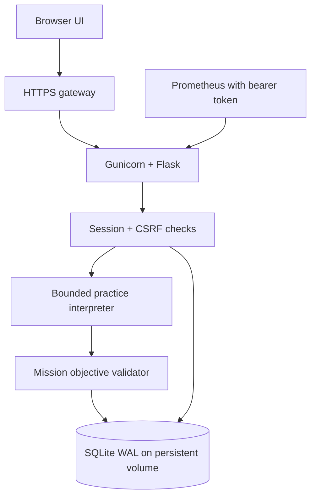

# Architecture

One origin serves both the dependency-free browser client and Flask JSON API. Gunicorn uses a fixed signing key shared by workers. SQLite WAL stores users, hashed session tokens, one active lab per user, completion records, bookmarks, activity, and rate-limit buckets.

The terminal command path does not import the Docker helper. Docker/Kubernetes/Git command responses are fixtures, not live infrastructure. Only Linux-style virtual file mutations change the stored practice workspace.

## Request lifecycle

1. `POST /api/session` resumes a valid session or allocates a bounded-rate guest profile and returns a CSRF token.
2. The browser gets public mission definitions, personal progress, recent activity, and preferences from `GET /api/overview`.
3. `POST /api/labs` resumes the matching mission or replaces the current unfinished lab with initial virtual state.
4. Commands are processed inside a SQLite write transaction. Virtual state changes are validated, completion is inserted with a unique `(user_id, mission_id)` key, and history is saved atomically.
5. The response contains output, objective states, awarded XP, and working directory. The client treats it as text, never HTML.

## API map

All mutations require JSON and `X-ShellArena: 1`. Except session creation, they also require the current `X-CSRF-Token`. Cookies carry the session. No bearer credential is exposed in localStorage.

| Method | Endpoint | Purpose |
| --- | --- | --- |
| POST | `/api/session` | Start/resume guest or account session |
| GET | `/api/overview` | Mission catalog and private progress |
| POST | `/api/auth/register` | Upgrade guest, preserving achievements |
| POST | `/api/auth/login` | Switch to an existing account |
| POST | `/api/auth/logout` | Revoke the current session |
| POST | `/api/labs` | Start/resume/reset one mission |
| GET | `/api/labs/{id}` | Retrieve owned lab state and history |
| POST | `/api/labs/{id}/commands` | Run a simulated command |
| POST | `/api/labs/{id}/hint` | Reveal the next hint |
| POST | `/api/bookmarks/{mission}` | Set saved state explicitly |
| POST | `/api/settings` | Set compact UI and leaderboard visibility |
| GET | `/api/leaderboard` | Top 50 opted-in account scores |
| GET | `/api/export` | Export private progress as JSON |
| GET | `/health/live` | WSGI process liveness |
| GET | `/health/ready` | Database-read readiness |
| GET | `/metrics` | Bearer-protected aggregate metrics |

## Capacity and boundaries

One lab per user, 40 saved commands per lab, 200 stored activity records per user, 50 activity records returned, 64 virtual files, 64 directories, 16 KB per file, 128 KB workspace data, 32 KB per command output, and 512 command characters. These are training constraints, not Linux semantics.

Streaks and daily missions use UTC. Activity timestamps are displayed in the browser's local timezone. Accounts and completion progress persist until an operator deletes them. Sessions expire after 7 days. The cleanup command removes guest profiles with no command activity for 30 days.

Schema version 1 is enforced at startup. Unknown versions fail rather than silently changing data. A future schema change requires an explicit migration and backup procedure.

## Expansion path

For higher traffic: move relational data to PostgreSQL, rate limiting to a shared service, and labs to a separate bounded state store; benchmark before adding app replicas. For real commands: introduce a separately authenticated runner service backed by stronger tenant isolation and lifecycle management. Do not wire the existing local Docker function into an HTTP route.
